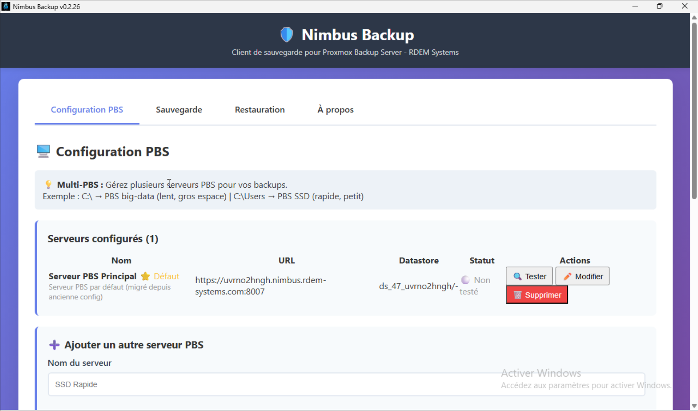
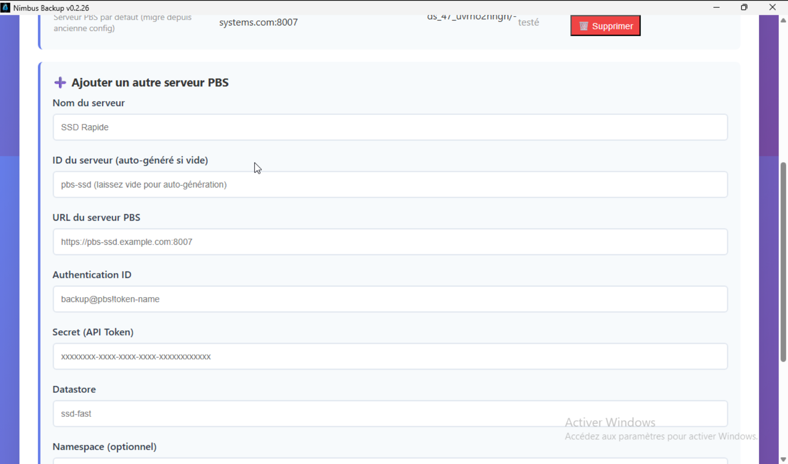
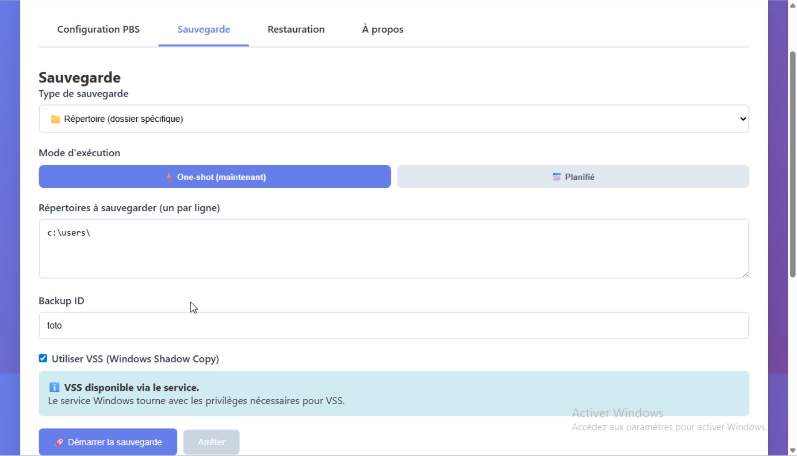

# Proxmox Backup Client — Windows-Client für Proxmox Backup Server

[🇬🇧 English](README.md) · [🇫🇷 Français](README.fr.md) · [🇮🇹 Italiano](README.it.md) · [🇩🇪 Deutsch](README.de.md) · [🇪🇸 Español](README.es.md) · [🇷🇺 Русский](README.ru.md) · [🇨🇳 中文](README.zh.md) · [🇯🇵 日本語](README.ja.md) · [🇬🇷 Ελληνικά](README.el.md) · [🇷🇴 Română](README.ro.md) · [🇸🇪 Svenska](README.sv.md) · [🇸🇦 العربية](README.ar.md) · [🇮🇷 فارسی](README.fa.md)

[](LICENSE)
[](https://github.com/tizbac/proxmoxbackupclient_go/releases)
[](https://github.com/tizbac/proxmoxbackupclient_go)

**Proxmox Backup Client ist ein Open-Source-Backup-Client (GPL-3.0) für Proxmox Backup Server (PBS), der unter Windows und Linux funktioniert.**
Es handelt sich um eine **Suite von Werkzeugen** für Backups zu PBS:

- **Proxmox Backup Client GUI** (basierend auf der Nimbus Backup GUI von RDEM Systems) — moderne grafische Oberfläche zum Sichern von Windows-Servern und -Arbeitsstationen in PBS: konsistente VSS-Snapshots, geplante Aufträge, Datei- und Datenträger-Modi, Snapshot-Durchsuchen/Wiederherstellen, Multi-PBS-Unterstützung und Windows-Dienstmodus.
- **`proxmoxbackup-directory`** — Kommandozeilenwerkzeug für Verzeichnis-Backups (PXAR) mit Deduplizierung.
- **`proxmoxbackup-machine`** — Kommandozeilenwerkzeug für vollständige Live-Backups von Windows-Systemen (FIDX, VSS, inkrementell).
- **`proxmoxbackup-nbd`** — NBD-Server zum Wiederherstellen von Datenträger-Backups (Linux).

> Schlüsselwörter: proxmox backup client windows · PBS-Client · Windows-VSS-Backup · unveränderliche Offsite-Backups · Proxmox-Backup-Server-Schnittstelle.

> ⚠️ **Haftungsausschluss:** Dieses Projekt steht **in keiner Verbindung** zu **Proxmox Server Solutions GmbH**. „Proxmox“, das Proxmox-Logo und verwandte Namen sind Eigentum ihrer jeweiligen Inhaber; sie werden hier **ausschließlich** zur Angabe der Kompatibilität verwendet. Siehe [proxmox.com](https://www.proxmox.com/) für deren Produkte.

> 🤖 **Diese Übersetzung wurde mit KI erstellt und kann kleine Fehler enthalten. Beiträge zur Verbesserung sind willkommen.**

## 📦 Download

👉 **[Neueste Version herunterladen](https://github.com/tizbac/proxmoxbackupclient_go/releases)**

> ⚠️ **Zeigt Windows „Virus gefunden“ (z. B. `Trojan:Win32/Sabsik.FL.A!ml`) oder eine SmartScreen-Warnung?**
> Dies ist ein **bekannter Fehlalarm** für Go/Wails-Anwendungen — es ist *kein* Virus. Das Suffix `!ml` weist auf eine Erkennung durch ein Machine-Learning-Modell hin, das *unsignierte und seltene* ausführbare Dateien markiert.
> Lesen Sie [warum das passiert und wie Sie den Download überprüfen](https://github.com/tizbac/proxmoxbackupclient_go).

### 🔎 Beliebigen Download überprüfen

Jedes Release stellt SHA-256-Prüfsummen und eine **signierte Provenienz-Bescheinigung** bereit (kryptografischer Nachweis, dass die Binärdatei von der CI dieses Repositorys aus einem bestimmten Commit erzeugt wurde):

```powershell
Get-FileHash .\ProxmoxBackupClient.exe -Algorithm SHA256   # mit SHA256SUMS.txt vergleichen
gh attestation verify .\ProxmoxBackupClient.exe --repo tizbac/proxmoxbackupclient_go
```

**VirusTotal — 0 Erkennungen.** Unabhängige Multi-Engine-Berichte der jüngsten MSI-Installer:
[0.2.108](https://www.virustotal.com/gui/file/6e8fb7ce9af740d470e947addb8daba4331c0b88e8bfdec9e0697ea8f7f29e9e/detection) ·
[0.2.107](https://www.virustotal.com/gui/file/6fd6c6fa77e0305c129ef882a3745100aa6033187a6d52a4af94149ab6b666d2/detection) ·
[0.2.106](https://www.virustotal.com/gui/file/ad6e56700ed9df8e088906e38cee2e2882fc7045f4e39269de0e379a01784ad7/detection)

> ℹ️ **Codesignierung:** Windows-Binärdateien sind **noch nicht Authenticode-signiert** (ein OSS-Zertifikat über [SignPath Foundation](https://signpath.org) ist ausstehend). Bis dahin wird die Provenienz über die oben genannte Bescheinigung und Prüfsummen hergestellt.

## 📚 Dokumentation

- **Vollständiger Proxmox-Backup-Leitfaden** — Best Practices für die PBS-Bereitstellung
- **Windows mit Proxmox Backup Server sichern** — spezifischer Windows-Bereitstellungsleitfaden
- **PBS vs. Veeam** — Vergleich von Proxmox-Backups

## ✨ Funktionen

### Proxmox Backup Client GUI (empfohlen)
- **🌍 Mehrsprachig** — Oberfläche auf Deutsch, Englisch und weiteren Sprachen
- Benutzerfreundliche Konfiguration mit Verbindungstest
- Backup-Fortschritt in Echtzeit mit Durchsatz und verbleibender Zeit
- VSS-Unterstützung (Volume Shadow Copy) für konsistente Backups
- Backup mehrerer Ordner, Datei- und Datenträger-Modi
- Snapshot-Durchsuchung, Dateisuche (Platzhalter) und Wiederherstellung
- Unterstützung mehrerer PBS-Server mit Zertifikats-Fingerprint-Pinning (TOFU)
- Windows-Dienstmodus + geplante Backups
- Debug-Protokollierung für die Diagnose

### 📸 Screenshots


*Multi-PBS-Serververwaltung mit Statusindikatoren*


*Einfache Serverkonfiguration mit Verbindungstest*


*Backup-Fortschritt in Echtzeit mit ETA und Durchsatz*

### Intelligente Systemausschlüsse (Dateimodus)
Beim Sichern eines ganzen Laufwerks (z. B. `D:\`) schließt Proxmox Backup Client automatisch aus:

**Systemordner:** `System Volume Information` (VSS-Speicher, kann 100+ GB erreichen), `$RECYCLE.BIN`, `Recovery`.
**Systemdateien:** `pagefile.sys`, `hiberfil.sys`, `swapfile.sys`.

**Warum das wichtig ist:** Ein Laufwerk kann 1,03 TB belegt anzeigen, während die tatsächlichen Dateien ~141 GB umfassen. Ohne Ausschlüsse würde das Backup die VSS-Snapshots enthalten (verschwendeter Speicherplatz und Zeit); mit ihnen entspricht die Größe den realen Daten.

**Empfehlung:** Verwenden Sie den **Dateimodus** (Standard) mit automatischen Ausschlüssen für Sicherungen auf Dateiebene; verwenden Sie den **Datenträgermodus** in einem separaten Auftrag für die Bare-Metal-Wiederherstellung (enthält alles).

### Sicherheit und Qualität
- Eingabevalidierung und Bereinigung von Anmeldedaten
- Schutz vor Path-Traversal
- Wiederholungslogik mit exponentiellem Backoff
- Umfassende Fehlerbehandlung und Tests, 100 % Lint-Konformität

## 🚀 Schnellstart

1. Laden Sie `ProxmoxBackupClient.exe` (oder die `.msi`) aus den Releases herunter
2. Starten Sie es mit Administratorrechten (für VSS erforderlich)
3. Konfigurieren Sie Ihre PBS-Verbindung und testen Sie sie
4. Wählen Sie die zu sichernden Ordner aus
5. Starten Sie das Backup

## 📋 Voraussetzungen

- Windows 10/11 (64 Bit)
- Administratorrechte (für VSS-Snapshots)
- Netzzugriff auf einen Proxmox Backup Server

## 🔨 Aus dem Quellcode kompilieren

### Voraussetzungen
- Go 1.22 oder neuer
- Node.js 20 oder neuer
- Wails CLI: `go install github.com/wailsapp/wails/v2/cmd/wails@latest`

### Build
```bash
cd gui
npm install --prefix frontend
wails build      # oder: wails dev  (Hot Reload)
```

## 🔧 Erweiterte Nutzung und Anleitungen

### Multi-PBS (mehrere PBS-Server)

Konfigurieren Sie mehrere PBS-Server und wählen Sie das Ziel für jedes Backup (z. B. `C:\Users` → schneller SSD-PBS, täglich; `C:\` → Big-Data-PBS, wöchentlich; plus ein DR-Server).

- **[Benutzerhandbuch](MULTI_PBS_USER_GUIDE.md)** — Hinzufügen/Testen von Servern, Standardserver, FAQ und Fehlerbehebung.
- **[Implementierungsleitfaden](MULTI_PBS_GUIDE.md)** — Datenmodell, automatische Migration von Einzel-PBS-Konfiguration, Backend-API-Methoden.

Eine bestehende Einzel-PBS-Konfiguration wird beim ersten Laden automatisch auf einen `default`-Server migriert.

### Clonezilla-ISO (Bare-Metal-Wiederherstellung)

Der Rettungs-Workflow wird erstellt, indem eine Clonezilla-Live-ISO mit den Binärdateien `pbsnbd` / `machinebackup` und einem **pbs-nbd**-Eintrag im Clonezilla-Hauptmenü gepatcht wird (Boot von CD, USB via `dd` und UEFI):

```bash
./patch-clonezilla.sh \
  -o clonezilla-live-patched.iso \
  clonezilla-live-3.3.3-15-amd64.iso \
  ./build/pbsnbd ./build/machinebackup \
  ./clonezilla-patch/ocs-pbs-nbd
```

Vollständige Details (warum ein vollständiger ISO-Neuaufbau statt eines Austauschs vor Ort, Voraussetzungen, Menüablauf, Prüfung) in **[PATCH-CLONEZILLA.md](PATCH-CLONEZILLA.md)**.

### Windows-GUI kompilieren

**Docker (empfohlen, besonders beim Kompilieren unter Linux).** Das Ein-Befehl-Skript erzeugt ein `ProxmoxBackupClientGO.exe` mit ordnungsgemäßer WebView2-Unterstützung, über einen Wegwerf-`golang`-Container (Installation von mingw + Wails, Build des Frontends, Ausführung von `wails build`):

```bash
./build_gui_windows_docker.sh
```

**Natives Windows (Chocolatey).** Siehe **[BUILD.md](BUILD.md)** für die vollständige Windows-Toolchain-Einrichtung:

```powershell
choco install go
choco install mingw
# dann, in einer nicht erhöhten Shell:
build.bat          # GUI
build_cli.bat      # CLI
```

### Funktionsstatus, Changelog und interne Dokumente

- **[FEATURES_STATUS.md](FEATURES_STATUS.md)** — Statusmatrix pro Funktion (implementiert / getestet / Roadmap).
- **[CHANGELOG.md](CHANGELOG.md)** — Versionshistorie der Änderungen.
- **[TODO.md](TODO.md)** — offene Roadmap und Ideen.
- **[RELEASE_NOTES.md](RELEASE_NOTES.md)** — stabiler Produktzustand und verfügbare Builds.
- **[MSI_UNINSTALL_TEST.md](MSI_UNINSTALL_TEST.md)** — MSI-Deinstallationsdialog (Konfiguration behalten/löschen) und sein Testplan.
- **[FIXES_SUMMARY.md](FIXES_SUMMARY.md)** — GUI-Fix-Notizen (Umschaltung zwischen Verzeichnis- und Maschinenmodus).

## 🖥️ GUI-Zuordnung

Die **Proxmox Backup Client GUI** basiert auf der **[Nimbus Backup GUI](https://nimbus.rdem-systems.com)**, entwickelt und gepflegt von **[RDEM Systems](https://www.rdem-systems.com/)**.

Die GUI (ursprünglich ein Fork dieses Projekts) wurde wieder in dieses Repository eingegliedert: Der gesamte Code einschließlich der GUI und aller ihrer Funktionen bleibt unter der GPLv3-Lizenz Open Source. RDEM Systems sponsert die GUI-Entwicklung und bietet kommerziellen Support dafür.

**Autor des ursprünglichen CLI:** Tiziano Bacocco (tizbac) · **Lizenz:** GPLv3

## ⚠️ Warnung

Diese Software wird „wie besehen“ bereitgestellt. Auch wenn wir Zuverlässigkeit anstreben, übernehmen wir keine Verantwortung für Datenverlust oder -schäden. Testen Sie Ihre Backups immer und überprüfen Sie die Wiederherstellung, bevor Sie sich in der Produktion darauf verlassen.

## 📄 Lizenz

GPLv3 — siehe Datei [LICENSE](LICENSE).

## 🏷️ Branding

Jeder Mitwirkende, der **mindestens 5 Commits** mit Funktionserweiterungen oder Fixes beigetragen hat, hat das Recht, seine Branding-Daten für kommerzielle Nutzung hinzufügen zu lassen.

Die einzigen Bedingungen sind, dass das Unternehmen, auf das das Branding verweist, **keine** der folgenden Aktivitäten durchführt:

- Malware-Kampagnen
- Unternehmen, die Krieg fördern (dies gilt für jedes Land, einschließlich westlicher Länder)
- Betrug
- Datendiebstahl
- Menschen-/Kinderhandel
- Gewalt
- Diskriminierung
- Drogen
- Jede allgemein als illegal anerkannte Aktivität

Geht eine Beschwerde gegen einen der Mitwirkenden ein, werden wir versuchen, Kontakt aufzunehmen; wird keine gültige Erklärung gegeben, **beenden wir diesen Vorteil sofort**.

Die **GPLv3-Lizenz bleibt aktiv**, und Sie können weiterhin das Projekt forken und Ihre eigenen ausführbaren Dateien erstellen.

## Über die Mitwirkenden von Proxmox Backup Client GO

Die Mitwirkenden von Proxmox Backup Client GO entwickeln und pflegen dieses Projekt. Die Software stützt sich auf die NTP/NTS-Infrastruktur und die [11 öffentlichen NTS-Server](https://github.com/jauderho/nts-servers), die in der Community-Referenz aufgeführt sind.

## 🤝 Mitwirken

Die GUI ist inzwischen vollständig implementiert, aber Beiträge sind weiterhin willkommen, insbesondere:

1. Unterstützung für Verschlüsselung (fehlt noch)
2. Physisch-zu-virtuell (P2V)-Migration, Wiederherstellung eines Bare-Metal-Backups in einer virtuellen Maschine (noch unvollständig)
3. Asynchroner Upload / Multi-Core-Upload von Chunks (Multi-Core-Komprimierung ist für Machine Backup bereits implementiert)
4. Patch auf Proxmox-Seite, um dem pxar-Format einen weiteren Eintragstyp mit Windows-Sicherheitsdeskriptoren hinzuzufügen
5. Unterstützung für Windows-Symlinks
6. Alles Interessante, das Ihnen einfällt :)

---

**© 2024-2026 Proxmox Backup Client GO Contributors and RDEM Systems.**